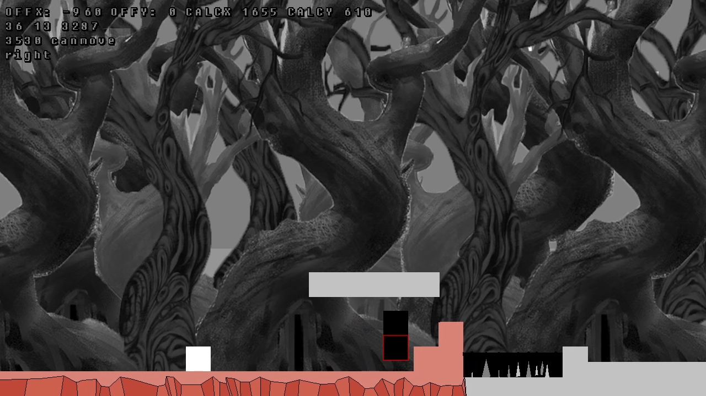

# legacy-lua-platformer
##### _Platformer_

## About
**Platformer** is a 2D side-scrolling platformer built with Lua and [LOVE2D](https://love2d.org), originally written around 2011. Jump, shoot, and grapple your way through tile-based maps.

## Features
- Side-scrolling movement with jump and grapple mechanics
- Tile-based collision via pixel-color map layers
- Projectile shooting in facing direction
- Enemy spawning and combat
- Camera tracking through large scrolling maps
- Sprint modifier
- Web build via love.js (WASM)

### Links

    
     
    <strong>Play:</strong>
     
    
    
     
    <strong>Source Code:</strong>
     
    
     
    

## Video

Click to play

## Running locally

    npm run setup      # install npm deps + download LOVE 11.5
    npm start          # launch the game

### Web build

    npm run build      # pack src/ into .love, compile to Web/ via love.js
    npm run serve      # serve Web/ at http://localhost:8080

## Documentation

See the [docs](docs/index.md) for game systems and controls.

## License

MIT License. See `LICENSE` file for details.
